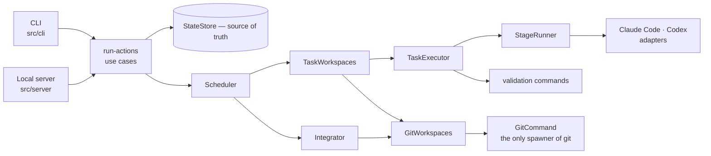

# Agent Flow

**English** · [Português (BR)](README.pt-BR.md)

[](https://github.com/lguilherme44/agent-flow/actions/workflows/ci.yml)

**A local-first orchestrator for coding agents.**

Agent Flow coordinates planning, execution, validation, Git-isolated task workspaces,
deterministic integration and review — while keeping every step inspectable and under
your control. It drives the coding CLIs you already have installed and logged into, with an
optional local-first advisory UtilityModel for context ranking and triage. Everything stays
under operator control on your machine.

```text
feature request
  → discovery
  → architecture analysis
  → SDD
  → planning
  → independent plan review
  → human approval          ← bound to one exact plan hash
  → implementation          ← optionally, one locked Git worktree per attempt
  → deterministic validation ← run by the orchestrator, never by an agent
  → deterministic integration
  → final review
  → Definition of Done
```

**Status:** `v0.1.0` · MVP 1, MVP 2, and MVP 3 complete · ready for independent final audit.

---

## What is Agent Flow?

An orchestration layer that sits above coding CLIs and turns "implement this feature"
into a workflow with a shape: separate stages, separate contexts, a human gate, and
outcomes decided by code rather than by an agent saying it finished.

The core knows nothing about specific vendor APIs and nothing about your framework.
Roles are logical (`architect`, `sdd`, `planner`, `planReviewer`, three `executors`,
`verification`, `finalReviewer`); configuration decides which runner and which effort
level serves each one.

Everything is local-first: run state, artifacts, the audit trail and the dashboard. There is
no cloud control plane and no telemetry upload. Core execution requires no API keys (using
your authenticated CLI sessions), while optional advisory context ranking and triage can connect
to an operator-configured local/remote OpenAI-compatible endpoint using environment-bound credentials (`apiKeyEnv`).

## Why Agent Flow?

Handing a feature to a coding agent tends to produce something plausible that nobody
reviewed. Agent Flow puts structure around that:

**Planning is separate from execution.** Each stage runs in a fresh context and
receives only the artifacts it needs, so a wrong assumption cannot travel silently from
discovery to the diff.

**A human decides.** Nothing is implemented until you have read the design document and
the task plan. Approval is bound to a *specific* plan — revise it and the approval no
longer applies.

**A model does not review its own work.** Configure two runners and the planner, the
reviewer and the implementer are different providers. With one runner it still works,
degrades to a same-provider review, and says so on the artifact.

**Fallback is infrastructure, never a fix.** A runner that is out of quota, not logged
in, or missing can be routed around. A model that produced bad output cannot — retrying
that elsewhere would replace a visible failure with a quiet one. The rule is enforced
by the type system.

**Done is decided by code.** Approved, all tasks complete, lint and tests and build
passing, final review PASS. An agent saying "finished" is not one of the conditions —
and in our first real run, that is exactly what caught a bad plan.

---

## Current status

```text
version          v0.1.0
MVP 1            complete  (Implementation Spec v3)
MVP 2            complete  — Safe Parallel Execution
  items          M2-00 … M2-12, all closed
parallelism      up to 8 tasks at once, in worktree mode only
npm              not published; install from a checkout
```

**Parallel execution is a feature now, and only under isolation.** With
`git.useWorktrees: true`, each task attempt runs in its own locked Git worktree on
its own branch, and `parallelism.maxTasks` is honoured up to a ceiling of 8. Without
worktrees the ceiling stays at 1 — tasks would otherwise share one working tree, one
diff and one set of validation commands — and a run that asked for more records a
`parallelism_clamped` degradation rather than quietly running narrow.

**Two numbers, and the difference is the point.** `requestedConcurrency` is what the
configuration asked for; `effectiveConcurrency` is what the run's mode allows. Both
are on the run, in `agent-flow run --dry-run`, and in the dashboard.

**What a parallel run guarantees.** Work reaches the integration branch one task at a
time, in the plan's topological order, whatever order the agents finished in; a task
is `completed` only once its marker is merged; a wave's base is the previous wave's
integrated result; a coordinator killed mid-run resumes without re-running an agent or
merging anything twice; and the working tree you are sitting in is byte-identical
before and after.

Full picture: [`docs/roadmap.md`](docs/roadmap.md). Normative source:
[`docs/specs/mvp2-safe-parallel-execution.md`](docs/specs/mvp2-safe-parallel-execution.md).

---

## Key capabilities

| Capability | Status |
|---|---|
| Local-first execution (CLI credentials, optional UtilityModel apiKeyEnv), no telemetry upload | Available |
| Persistent run state and append-only event log | Available |
| DAG scheduling with wave/barrier semantics | Available |
| Claude Code and Codex adapters | Available |
| Validation commands run by the orchestrator | Available |
| Approval gate bound to a plan hash | Available |
| Cross-provider plan review and final review | Available |
| Local dashboard, read and write, over the same use cases | Available |
| Inter-process run execution lock | Available |
| Git worktree isolation, one locked worktree per attempt | Available — opt-in, `git.useWorktrees` |
| Attempt receipts: validated tree plus a post-agent nonce | Available in worktree mode |
| Marker commits, reproducible from the attempt artifact | Available in worktree mode |
| Deterministic serial integration in topological order | Available in worktree mode |
| Verification and review against the integration tree | Available in worktree mode |
| Git hook isolation for internal operations | Available |
| Crash recovery for isolated runs, from evidence on disk | Available in worktree mode |
| Retry as a fresh attempt, with the previous one retained | Available in worktree mode |
| Git-aware `clean` (worktrees, refs, branch retention) | Available |
| Isolation and concurrency facts in the dashboard | Available |
| More than one task at a time | Available — worktree mode, up to 8 |
| `pause` / `resume` / `cancel` | Available |
| Configuration writes from the dashboard | Designed, not built |
| Remote or distributed execution | Out of scope for MVP 2 |

---

## Stopping a run

Two operations, and they are not the same one.

```bash
agent-flow pause          # stop starting work; the task in flight finishes
agent-flow resume         # clear the pause and carry on
agent-flow cancel --yes   # end it, terminate the agents, keep everything
```

**Pause is cooperative.** It records a request and returns. The scheduler reads it at the
top of its dispatch loop, between tasks — never during one, because a task's result file is
written once at the end and severing it would throw away work already paid for. So the
report is "pausing…", then "paused", and `agent-flow run` typed afterwards is refused with
`resume` as the way out. The request is on disk, so it holds across processes: pause in one
terminal, and the run in another meets it.

**Cancel is not.** It terminates the running agents' whole process groups, moves the tasks
that were running to `interrupted`, and leaves the run in a terminal `cancelled` status
that is neither `completed` nor `failed` — reporting an operator's decision as a failure
would make every surface describe a choice as a defect.

**Cancel deletes nothing.** Not the integration branch, not the failed worktrees, not a
single attempt artifact. A cancelled run is the one you are most likely to want to read.
Cleaning up stays a separate, deliberate act: `agent-flow clean`.

What neither can do is un-edit files. In worktree mode a cancelled task's edits are
confined to its own workspace and your checkout is untouched, as always; without worktrees,
a cancelled task leaves the working tree wherever the agent had reached, and the
confirmation says so in those words.

---

## How it works

A run's lifecycle, as the code actually implements it:

```text
feature request
      ↓
discovery → architecture impact → SDD → plan → independent plan review
      ↓
human approval                     ← bound to this plan's hash
      ↓
DAG over the plan's tasks
      ↓
ready set → one wave                ← up to effectiveConcurrency, in parallel
      ↓
task attempt
      ↓
prepared workspace                  ← worktree mode: created, locked, asserted clean
      ↓
coding agent                        ← cwd = the workspace
      ↓
validation commands                 ← run by Agent Flow, in the same workspace
      ↓
attempt artifact + receipt          ← worktree mode: written outside every worktree
      ↓
marker commit                       ← the exact tree validation ran against
      ↓
deterministic integration           ← serial, topological order
      ↓
task completed                      ← in worktree mode, completed means integrated
      ↓
wave barrier → next wave
      ↓
final verification + final review + Definition of Done
```

Five words that are often collapsed and mean different things here:

| | |
|---|---|
| **execution** | the agent ran in a workspace and exited |
| **validation** | the orchestrator ran the task's commands there, and judged the expectation |
| **marker** | a commit whose tree *is* the validated tree, built from the attempt artifact |
| **integration** | that marker merged into the run's integration branch |
| **completed** | in worktree mode: integrated. Not "the agent said it was done" |

In sequential mode — the default — there is no workspace, no marker and no integration
branch: a task completes when its validation is judged, exactly as it always has.

---

## Architecture



The layering is enforced by executable rules, not by convention
(`test/architecture.test.ts`):

- `src/core/` imports no Node built-in and no adapter, and names no provider, model or CLI
- topological ordering exists in exactly one module
- the core side never imports the server; the server never imports the CLI
- no request contract accepts a filesystem path, a command or a plan hash
- there is one project registry, one DAG and one run execution lock
- `StateStore` executes no Git command and imports nothing from `src/adapters/git/`
- in worktree mode, only the Integrator may write `completed`

That last rule is not stylistic. Without it, the invariant is one careless
`status: 'completed'` away from being false, and the failure would be silent: the DAG
would release dependents against a branch that does not contain their dependency's work.

---

## Safety model

**Evidence before trust.** Git refs, commit messages and trailers are supporting
evidence, never the primary authority. The authority is the attempt artifact the
orchestrator wrote; the repository is used to confirm what that artifact already claims.

**The agent cannot forge its own validation.** An implementation agent has write
permission inside its workspace, so any evidence it could produce is evidence it chose
to produce. The separation is an ordering:

```text
the agent's process exits          ← nothing below can start earlier
        ↓
validation runs, and is judged     agent-flow runs it, not the agent
        ↓
git add -A · git write-tree      → the tree validation ran over
128 random bits from the OS        ← the nonce first exists HERE
        ↓
attempt-<n>.json, written once, atomically, outside every worktree
        ↓
git commit-tree <tree> -p <base>   the marker, built from that file
```

The nonce does not exist while the agent is alive. The marker's tree *is* the validated
tree, and a mismatch is a refusal rather than a repair. The stated limit — and it is
stated rather than hidden — is that this is not unforgeable against an agent that
escapes its worktree and writes into `.agent-flow/runs/`. What it buys is a raised bar,
not a proof.

**No user Git hook runs inside an Agent Flow operation.** Every internal Git command
carries `-c core.hooksPath=<an owned, empty directory>`, placed before the subcommand
where no caller argument can override it. Your hooks are untouched and run normally
when *you* merge the integration branch. Agent Flow never writes to `git config`.

**Containment during execution is the runner's, not ours.** Read-only stages run under
`--permission-mode plan` (Claude Code) or `-s read-only` (Codex), and Agent Flow never
passes the flags that disable them. But it spawns a CLI as a child process and cannot
intercept what that process runs. Anything stronger needs a container.

**The browser supplies ids, never paths, refs, branches or commands.** The local server
resolves every trusted value from run state and its own registry.

Details, including what having no authentication does and does not mean:
[`docs/security.md`](docs/security.md).

---

## Requirements

- **Node 20+**
- **git** — any version for sequential mode; **2.33.0 or newer** for worktree
  isolation, which needs `git worktree add --lock --reason`. `agent-flow doctor`
  reports your version against that floor.
- At least one agent CLI, installed and logged in (e.g. AGY, OpenCode, Claude Code, Codex CLI).
- *(Optional)* A local or remote OpenAI-compatible model endpoint (e.g. Ollama, llama.cpp, vLLM) for advisory context intelligence and mechanical triage.

**Credentials & Privacy:**
- **Local CLI Runners:** Agent Flow invokes the CLIs you have already authenticated in your environment. It never reads, stores, or transmits runner credentials.
- **UtilityModel:** If configured, the API key is referenced strictly by environment variable name (`apiKeyEnv`) and resolved in memory at composition time. Config files and telemetry never store or persist raw API keys.
- **Zero Telemetry Uploads:** All telemetry, audit trails, and execution states remain strictly on your local machine.

---

## Installation

Not on npm. Install from a checkout — the package is built, packed and verified to work
outside one, so this is the same artifact a publish would produce:

```bash
git clone https://github.com/lguilherme44/agent-flow
cd agent-flow

npm install
npm run build
npm run build:web

npm install -g "$(npm pack | tail -1)"
```

## Quick start

```bash
cd ~/my-project

agent-flow init          # detect the stack, read your real scripts
agent-flow doctor        # can this environment work?

agent-flow feature "Add recurring bookings"
agent-flow status        # read the SDD and the plan
agent-flow approve       # the gate — bound to this plan, not the next one
agent-flow run
agent-flow review

agent-flow ui            # the local dashboard on 127.0.0.1:4782
```

One dashboard over several repositories:

```bash
agent-flow ui ~/wk
```

Walked through with a real four-task feature, a DAG and the artifacts it produces:
[`docs/example-walkthrough.md`](docs/example-walkthrough.md).

### Commands

| Command | |
|---|---|
| `init` | Prepare a repository. Detects the stack, reads your real scripts, never overwrites without `--force`. |
| `doctor` | Can this environment work? Reports `OK` / `DEGRADED` / `FAIL`, plus the Git version against the worktree floor and whether your install command leaves a fresh checkout clean. `--deep` probes each runner for real, which spends quota. |
| `feature "<description>"` | Discovery → impact → SDD → plan → review. Stops at the gate. |
| `status` | Where the run is, what it produced, what is degraded, and which isolation mode it was born in. |
| `approve` | Open the gate. Refuses a failed review unless `--force`. |
| `reject` · `revise "<instruction>"` | Close a run, or re-plan with guidance. |
| `run` · `task TASK-004` · `retry TASK-004` | Execute the approved plan. |
| `review` | Run validation, inspect the code, judge it against the SDD. In worktree mode all three read the integration tree, under the run lock. `--fix` turns findings into tasks and reviews the corrected plan. |
| `ui [root]` | Serve the local dashboard on `127.0.0.1:4782`. With a directory, serves every initialised repository under it as a workspace. See [`docs/web-ui.md`](docs/web-ui.md). |
| `clean` | Remove old run state, and the Git namespace that goes with it: this run's worktrees and attempt refs, never anything foreign. Keeps the five most recent runs, and never the active one without `--force`. An integration branch that is merged nowhere is **kept and reported** — `--branches` is the only flag that deletes work. |

`--dry-run` shows the routing without invoking anything, and prints requested versus
effective concurrency. `--verbose`, `--json`, `--strict` behave as you would expect.

---

## Project configuration

Two files: global holds your preferences, the project file holds what makes this
repository different.

```yaml
# ~/.agent-flow/config.yaml
roles:
  architect:     { runner: claude, effort: high }
  sdd:           { runner: claude, effort: high }
  planner:       { runner: codex,  effort: high }
  planReviewer:  { runner: claude, effort: high }
  executors:
    trivial:     { runner: codex,  effort: low }
    normal:      { runner: codex,  effort: medium }
    complex:     { runner: codex,  effort: high }
  verification:  { runner: codex,  effort: medium }
  finalReviewer: { runner: claude, effort: very_high }

fallback:
  enabled: true
  on: [quota_exceeded, auth_required, runner_unavailable]

parallelism:
  maxTasks: 1

retry:
  maxAttempts: 2

git:
  useWorktrees: false
```

`model:` is optional on purpose — omit it and each CLI uses the model you already
configured. `effort` is logical (`low` … `very_high`); each adapter translates it. The
three fallback triggers above are the only ones the schema accepts.

```yaml
# <project>/.agent-flow/config.yaml
project: { name: booking-api, type: node }

commands:            # run by Agent Flow, never by an agent
  install: npm ci
  lint: npm run lint
  test: npm test

validationCommands:  # extra ids a task may reference
  recurrence: npm test -- recurrence

rules:
  architecture:
    - "Controllers do not talk to the database directly"
```

`init` fills these from what your repository actually declares. A command it cannot
find is left empty rather than guessed.

### The two settings that need explaining

**`git.useWorktrees`** — default `false`.

| | |
|---|---|
| Controls | whether a run isolates each task attempt in its own Git worktree |
| Read | **once**, by `createRun`, and captured on the run as `isolationMode` |
| Constraint | changing it later does not move an existing run between modes; it is the default for the *next* run |

That immutability is load-bearing rather than cautious. Planning under one answer and
implementing under another builds the work against a tree nobody planned against — and
every individual check passes while it happens. The mode is a property of the run, so
`status` reports both the run's mode and what your configuration currently says.

**`parallelism.maxTasks`** — default `1`.

| | |
|---|---|
| Controls | *requested* concurrency. Configuration records intent |
| Constraint | the runtime resolves it against the run's isolation mode |
| In worktree mode | honoured, up to a ceiling of **8** |
| Without worktrees | resolved to **1**, whatever you write |

Requested and effective are two different numbers, and the product answers both:
`agent-flow run --dry-run` prints them side by side, and a run that asked for more than
its mode allows carries a `parallelism_clamped` degradation rather than running narrow
in silence.

The ceiling of 8 has a stated basis rather than a round-number one: each concurrent
task is an agent process, a full checkout of your repository and an install of its
dependencies. `agent-flow doctor` projects the disk that implies before you turn it on.

**Whether it is worth it depends on your project, and the honest answer is sometimes
no.** A stack whose per-worktree install and analysis costs more than the work it
parallelises will not go faster — see [`docs/testing.md`](docs/testing.md) for what was
measured. Isolation is worth having on its own: it is what keeps two agents from
writing into one tree, and what makes a failed attempt something you can still read.

---

## Coding agents

Two adapters exist, both driving a CLI you have already authenticated:

| Runner | `type` | Requires | Auth | Read-only mode |
|---|---|---|---|---|
| Claude Code | `claude-code-cli` | the `claude` binary on `PATH` | your existing CLI login | `--permission-mode plan` |
| Codex | `codex-cli` | the `codex` binary on `PATH` | your existing CLI login | `-s read-only` |

```yaml
runners:
  claude:
    type: claude-code-cli
    enabled: true
  codex:
    type: codex-cli
    enabled: false      # flip once the CLI is installed and logged in
```

Only one runner is enabled out of the box, because the tool has to work on a machine
that never installed a second CLI. Enabling the second is what makes plan review and
final review genuinely cross-provider — and `doctor` reports the single-provider state
as `DEGRADED`, so the loss is never silent.

No third adapter is claimed. An abstract interface is not compatibility;
[`docs/runner-capabilities.md`](docs/runner-capabilities.md) records what each CLI
actually does, with the command that proves each claim and the version it was probed
against.

---

## Validation

Validation is the orchestrator's job, and structurally so:

- **A plan names ids, never commands.** `validation: ["lint", "recurrence"]` is resolved
  against `commands` and `validationCommands` in *your* project file. Model output
  cannot reach a shell, because a plan cannot carry a shell command in the first place.
- **Agent Flow runs them**, in the task's workspace, after the agent's process exits.
- **The expectation is explicit.** `validationExpectation: pass | fail | none`. `fail`
  exists because test-first work has a step where a green suite is the failure — and a
  RED task whose tests *pass* is reported too, because either the test asserts nothing
  or the behaviour already exists.

---

## Git isolation — worktrees

Opt in with `git.useWorktrees: true`. The principle is one sentence:

> **Isolation first, parallelism second.**

The point is not to run more agents at once. It is to stop multiple tasks from sharing
one working tree, one `git status`, one `AGENTS.md` and one set of validation commands
— which would make each agent's validation judge a tree the others were editing. Three
properties follow from isolation alone, and are worth having even at concurrency 1:

- **Your working tree stops being the build surface.** A run no longer edits the tree
  you have open in your editor.
- **A task's diff is separable.** Each task has a tree, a base and a marker, instead of
  every task's work superimposed at review time.
- **A failed task leaves evidence rather than debris.** Its worktree is retained and
  still locked, because it is the only remaining copy of what the agent produced.

How it is laid out:

```text
~/.agent-flow/
├── no-hooks/                       owned, empty — the hook isolation directory
└── worktrees/
    └── <repoKey>/
        └── <gitRunKey>/
            ├── integration/        the integration branch, checked out
            ├── TASK-001/attempt-1/
            └── TASK-002/attempt-1/
```

Worktrees live **outside** the repository and outside `.git`. Both alternatives were
probed and rejected: Codex writes inside `.git` and Claude Code refuses to, which would
make placement a runner-dependent behaviour in a runner-agnostic core; and a worktree
inside the working tree is content the outer `git status` sees, which is exactly the
surface this milestone exists to keep clean.

Each attempt worktree is created **locked**, with its branch, in one command. Absolute
paths are never persisted — the attempt artifact records a workspace-relative path, so
a path cannot leak to the browser even by accident.

Before a task runs, its workspace is asserted clean, set up with `commands.install`,
and asserted clean **again**. A setup that dirties the checkout refuses the task without
invoking the agent. This is the gate most people meet first, because the default
`npm install` rewrites `package-lock.json`; `agent-flow doctor` probes it before a run
rather than after, and names the file.

---

## Deterministic integration

After a wave's attempts all finish, integration runs — serially, in the plan's stable
topological order, never in completion order.

Per task, in the integration worktree:

1. load the attempt artifact — no artifact, no integration
2. the receipt must be present and the judgement `satisfied`; the schema makes a
   half-forged artifact unparseable
3. the marker must have **exactly one** parent, and it must be the attempt's base — the
   parent count is the structural discriminator, not the subject line
4. `rev-parse <marker>^{tree}` must equal the receipt's validated tree
5. if the marker is already an ancestor, the merge already happened; skip
6. `git merge --no-ff`, hooks disabled
7. write the task's result, set it `completed`, and advance `integrationHead` — **in one
   state write**

No validation command runs anywhere in that sequence. Integration verifies mechanical
Git integrity; final verification is the authority on whether the code is good.

Two runs of the same plan with the same agent outputs produce the same integration
branch — the same markers, byte-identical, merged in the same order, producing the same
trees. The merge *commits* differ in timestamp and therefore in hash, and that claim is
deliberately not made.

`--no-ff` is used even when a fast-forward would be possible: one task, one merge
commit, always. Otherwise the shape of the branch would depend on how many tasks a wave
happened to contain.

**The product of a run is a branch.** Agent Flow never checks it out into your working
tree, never merges it into your branch, never pushes, and never moves your `HEAD`. The
final review prints where the code is and what to do with it — and that last command
runs your hooks, exactly as it should.

Final verification and final review both run in the integration worktree, against one
commit, under the run execution lock. There is no "verified tree A, reviewed tree B"
gap, and the commit all three describe is recorded on the run as `integrationHead`.

---

## Artifacts and auditability

```text
<project>/.agent-flow/
├── config.yaml                     versioned — a team convention
├── current-run
├── cache/architecture.md           repository map, reused across features
└── runs/AF-2026-001/
    ├── state.json                  the source of truth
    ├── events.jsonl                append-only audit trail
    ├── request.md
    ├── architecture-impact.md
    ├── sdd.md
    ├── plan.json
    ├── reviews/
    │   ├── plan-review.json
    │   ├── verification.json
    │   └── final-review.json
    ├── tasks/TASK-001/
    │   ├── result.json             the task's outcome
    │   └── attempt-1.json          one attempt's evidence — worktree mode only
    └── logs/
        └── implementation-TASK-001-attempt-1.log     ← worktree mode
        └── implementation-TASK-001.log               ← sequential mode
```

Everything with content lives inside a run, so two features in flight cannot overwrite
each other. Task results record the runner, model and effort that actually served the
call, not the ones the configuration asked for. In worktree mode, attempt artifacts and
logs are addressed by attempt, so a retry never overwrites the record of the attempt
you are retrying because you wanted to read it.

`state.json` and `events.jsonl` contain no worktree paths at all. The attempt artifact
is written once, atomically — a second write to an existing `attempt-<n>.json` is a
refusal, including when the bytes are identical.

---

## Example

[`docs/example-walkthrough.md`](docs/example-walkthrough.md) runs one feature from
`init` to a mergeable branch: a four-task plan with a real DAG, the configuration that
matters, what each command prints, and where to look for every artifact afterwards.

---

## Current limitations

Not a roadmap — what is true today.

- **Parallel execution requires worktree mode.** Without `git.useWorktrees`,
  `parallelism.maxTasks` above 1 is accepted, recorded and clamped to 1. There is no
  path from "the worktrees are not usable" to "run two agents in your checkout" — an
  unmet precondition is a refusal, not a downgrade.
- **A merge conflict halts the run.** Automatic conflict resolution is explicitly out of
  scope; the task becomes `review_required` with the conflicting paths recorded, and the
  fix is a retry over the new integration head, or a plan whose tasks do not overlap.
- **Parallelism does not pay off on every stack.** A per-worktree dependency install and
  a heavy analyzer can consume the whole gain. It was measured rather than assumed —
  [`docs/testing.md`](docs/testing.md) has the numbers, including where the answer is no.
- **An isolated run needs a clean working tree at the gate.** The planning base is a
  commit, and a dirty checkout means the plan was written against something that is not
  in the repository. It refuses with `working_tree_dirty` and tells you which files.
- **A wave may contain at most one unpaired RED per validation command.** A task is
  judged by running your whole suite in its own worktree, so it inherits every test that
  is red in its base — including one a sibling wrote deliberately. Two test-first tasks
  in one wave therefore make the next wave's implementations unsatisfiable, each failing
  on the other's test. Keep a module's tests and its implementation in one task. Found
  by dogfood; see [`docs/troubleshooting.md`](docs/troubleshooting.md).
- **No `pause`, `resume` or `cancel`.** The core has no semantics for any of them.
- **No configuration writes.** `/settings` reads. Deciding which of three layers a value
  belongs in is the whole problem.
- **Local only.** Loopback by default, no authentication, no cloud control plane. Anyone
  who can reach the port can approve a plan and start a run.
- **Not on npm.** No published package and no GitHub release; install from a checkout.
- **Worktree mode is unvalidated on Windows** — no CI job, and the process timeout
  cannot signal a process tree there, so a CLI that spawns children can outlive its
  timeout.
- **Visual baselines are per platform.** darwin and Linux sets are both committed and
  never compared against each other; font rasterisation differs.
- **A lock claim can be unreadable under contention.** Mutual exclusion is unaffected,
  but the refusal then says the claim could not be read rather than naming who holds it.
  Deferred deliberately — see [`docs/engineering/findings.md`](docs/engineering/findings.md).
- **Prompt quality has no automated test and cannot have one.** It is the largest risk
  in the project, and it is covered by judgement rather than by the suite.

### Not yet validated

- [x] Worktree mode dogfooded end to end against live CLIs, on Node and Flutter (M2-12)
- [ ] Go or Rust repositories (stack detection is unit-tested only)
- [ ] Fallback and reasoning clamping against a live CLI
- [ ] Cost across models and repository sizes

<details>
<summary><b>What MVP 1 shipped</b> — the checklist, kept for the record</summary>

- [x] CLI, config resolution, logical roles, reasoning abstraction
- [x] `ClaudeCodeRunner`, `CodexRunner`, capability model, error normalisation
- [x] Fallback restricted to infrastructure failures, enforced by the type system
- [x] `doctor` with ternary health computed over role routes
- [x] `init` with stack detection for Node, Flutter, Python, Go, Rust
- [x] Discovery → architecture impact → SDD → plan, checkpointed per stage
- [x] Coverage and dependency-graph checks as code, before any reviewer runs
- [x] Cross-provider plan review, with independence recorded on the artifact
- [x] Approval gate bound to a plan hash
- [x] Deterministic router, DAG scheduler, task executor, resume and retry
- [x] Verification commands run by the orchestrator, not by an agent
- [x] Final review and Definition of Done evaluated as code
- [x] `review --fix` — findings become tasks in the plan and re-enter the pipeline
- [x] Corrective rounds reviewed in their own right, so the loop needs no `--force`
- [x] `doctor --deep` — live probe per runner, folded back into the verdict
- [x] Local telemetry, derived from the run's own state and event log
- [x] `agent-flow ui` — local server and dashboard, seven pages over eight routes
- [x] Live updates over SSE, with polling as the documented fallback rather than the default
- [x] Write actions — approve, reject, revise, retry, start — as one set of use cases the
      CLI and the HTTP API are both adapters over
- [x] Inter-process run lock, proved with eight real processes racing one lock file — and
      with an opt-in stress run of 640 (`AF_LOCK_STRESS=1`)
- [x] Dependency graph drawn from the server's answer, never rebuilt in the browser
- [x] Workspace mode bounded by `ui.workspaceDepth`, discovering nothing outside the root
- [x] Empty, error and degraded states that say what happened and what to do about it
- [x] Deterministic browser E2E — sixteen scenarios across the real local server
- [x] Screenshot regression in CI, on Linux baselines, in a pinned container
- [x] Cross-platform workspace containment, with the Windows rules asserted on Linux
- [x] Packaging proved outside the checkout, plus a black-box browser journey through
      the installed tarball

**Validated end to end against live CLIs.** One Node and one Python repository have run
the whole workflow — plan, cross-provider review, approval, implementation, verification,
final review, Definition of Done. The Python run reached `FEATURE COMPLETE` after a
corrective round: the final review rejected it, `--fix` turned the findings into tasks,
and the tests those tasks produced kill the corresponding mutations.
[Findings §10–§13](docs/engineering/findings.md) records what that surfaced.

</details>

<details>
<summary><b>Known defects from the MVP 1 validation review</b> — all fixed</summary>

A structured review of the first complete implementation confirmed 17 findings. All
twelve code-level defects are fixed; each reproduction was inverted and moved into the
suite of the feature it belongs to. The review is kept as written, in
[`docs/reviews/validation-review.md`](docs/reviews/validation-review.md), with the
re-analysis in [`docs/reviews/reanalysis-post-fixes.md`](docs/reviews/reanalysis-post-fixes.md).

- [x] **V-01 · critical** — planner-authored strings reach `/bin/sh -c`; no allowlist → **fixed:** `validation` holds ids resolved against the project config
- [x] **V-09 · high** — the process timeout never fires when the child has children → **fixed:** the child runs in its own process group
- [x] **V-02 · high** — `FallbackRunner` is never constructed at runtime → **fixed:** wired through `runner-factory`
- [x] **V-03 · high** — a task interrupted mid-flight stays `running` forever → **fixed:** recovered as `interrupted` and requeued
- [x] **V-04 · high** — test-first plans cannot express an expected failure → **fixed:** `validationExpectation: pass | fail | none`
- [x] **V-05 · medium** — `agent-flow task` builds a graph missing its dependencies → **fixed:** the graph stays whole, execution is restricted
- [x] **V-06 · medium** — `result.json` records a hardcoded reasoning level → **fixed:** provenance travels from the runner that actually ran
- [x] **V-07 · medium** — the discovery cache is reused without invalidation → **fixed:** fingerprinted on HEAD, working tree, AGENTS.md and config
- [x] **V-08 · medium** — validation commands run twice, once by the agent → **fixed:** the prompt says Agent Flow owns the run
- [x] **V-10/11/12 · low** — `approvedAt` now recorded, dead prompt role metadata removed, CLI copy corrected

See [Findings §8](docs/engineering/findings.md#8-a-structured-review-found-things-the-build-did-not).

</details>

---

## Roadmap

```text
MVP 2 — Safe Parallel Execution

[x] M2-00  current concurrency safety (baseline)
[x] M2-01  pure worktree policies and naming
[x] M2-02  GitCommand and GitWorkspaces
[x] M2-03  run identity capture and planningBase gates
[x] M2-04  workspace lifecycle and setup cleanliness
[x] M2-05  TaskAttemptResult, trusted receipt, marker
[x] M2-06  deterministic Integrator and integration-tree verification
[x] M2-07  crash recovery
[x] M2-08  retry semantics and attempt retention
[x] M2-09  Git-aware cleanup
[x] M2-10  read models, CLI and Web observability
[x] M2-11  parallel scheduler activation               ← effectiveConcurrency > 1
[x] M2-12  E2E, dogfood and documentation

MVP 2 complete.
```

Full roadmap, including what MVP 1 established and what is deliberately out of scope:
[`docs/roadmap.md`](docs/roadmap.md).

---

## Documentation

**Product**

| | |
|---|---|
| [`docs/example-walkthrough.md`](docs/example-walkthrough.md) | One feature, four tasks, from `init` to a mergeable branch |
| [`docs/web-ui.md`](docs/web-ui.md) | The dashboard: the two modes, the pages, the DAG, live events, what it can change and what it cannot, the HTTP API |
| [`docs/troubleshooting.md`](docs/troubleshooting.md) | What a message means and what to do about it |
| [`docs/roadmap.md`](docs/roadmap.md) | What is done, what is next, and what is out of scope |

**Architecture & engineering**

| | |
|---|---|
| [`docs/security.md`](docs/security.md) | The trust model: the receipt, hook isolation, the server's boundary, the run lock, and the limits stated plainly |
| [`docs/testing.md`](docs/testing.md) | The test layers, what each one proves, and where each one stops |
| [`docs/runner-capabilities.md`](docs/runner-capabilities.md) | What each CLI actually does, with the command that proves it and the version it was probed against |
| [`docs/engineering/findings.md`](docs/engineering/findings.md) | Engineering log: what building this taught us, including what is still unsolved |

**Specification**

| | |
|---|---|
| [`docs/specs/mvp2-safe-parallel-execution.md`](docs/specs/mvp2-safe-parallel-execution.md) | **MVP 2 — Safe Parallel Execution.** The current normative spec. Supersedes §19 and §47–§48 of Spec v3 |
| [`docs/specs/implementation-spec-v3.md`](docs/specs/implementation-spec-v3.md) | Implementation Spec v3 — MVP 1, complete. **A historical document**; the code is the current truth |

**Technical reviews** — snapshots, not living documents

| | |
|---|---|
| [`docs/reviews/validation-review.md`](docs/reviews/validation-review.md) | Structured validation review of the first complete implementation |
| [`docs/reviews/reanalysis-post-fixes.md`](docs/reviews/reanalysis-post-fixes.md) | Re-analysis after those fixes landed |

**Designs, not implementations** — written up, deliberately not built

| | |
|---|---|
| [`docs/config-write-design.md`](docs/config-write-design.md) | `PATCH /config`: why scope has to be part of the address |
| [`docs/pause-resume-cancel-design.md`](docs/pause-resume-cancel-design.md) | `pause` / `resume` / `cancel`: the abort signal and the contract change they need |

---

## Development

```bash
npm install
npm run build          # the CLI bundle
npm run build:web      # the dashboard bundle
npm run check          # typecheck + lint + Vitest + dashboard unit tests

npm run dev:web        # dashboard against a running `agent-flow ui`
```

Once built, the CLI runs from the checkout as `node dist/bin/agent-flow.js`, or
`npm link` it and use `agent-flow` as documented above.

## Tests

```bash
npm run test                    # Vitest — unit, integration, architecture
npm run test:e2e                # Playwright, through the real local server
npm run test:visual             # Playwright, screenshots (this platform's baselines)
npm run test:packaging          # pack, install elsewhere, drive the installed product
npm run test:packaging:browser  # the same, through gsd-browser
```

**No suite invokes a real coding CLI.** Runners are exercised through a scripted
`AgentRunner`; adapters are tested by asserting the exact argv they build and by parsing
recorded tool output — the two cases that could not be provoked on demand are labelled
`SYNTHETIC-` in `test/fixtures/`. That is what keeps the suite fast, free and runnable
in CI.

**Git is not faked.** Everything MVP 2 touches — worktree creation and locking, hook
isolation, `write-tree`, `commit-tree`, merges, ancestry, cleanup — is tested against
real repositories in temporary directories, under a temporary home. Platform
differences in worktree behaviour are exactly the class of thing only real Git catches.

[`docs/testing.md`](docs/testing.md) explains what each layer can and cannot prove,
including why the gsd-browser smoke does not replace Playwright and why it runs locally
rather than in CI.

CI runs `check` on Node 20 and 22, the browser E2E and the screenshot suite in a pinned
container, and coverage as a report rather than a gate. The packaging smokes run
locally.

---

## Contributing

The project is pre-release and the specification leads the code. Before opening a pull
request against MVP 2 behaviour, read
[`docs/specs/mvp2-safe-parallel-execution.md`](docs/specs/mvp2-safe-parallel-execution.md)
— §3 lists the invariants, and §30.1 lists the designs that were considered and
rejected, with the evidence for each. A change that violates an invariant is a change
to the specification, not an implementation detail.

```bash
npm run check     # must be green
```

Two rules that are enforced rather than requested:

- **`test/architecture.test.ts` is updated, never deleted.** The layering rules are
  executable, and a rule that becomes inconvenient is a conversation, not a diff.
- **Milestone order is not negotiable.** `effectiveConcurrency > 1` is M2-11 for reasons
  §29 states exactly; landing it early is the one risk the specification rates critical.

---

## License

MIT — see [`LICENSE`](LICENSE).
