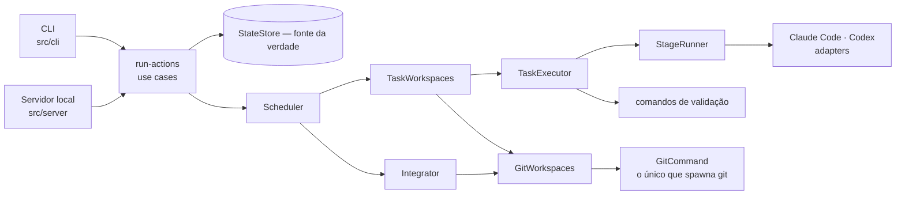

# Agent Flow

[English](README.md) · **Português (BR)**

[](https://github.com/lguilherme44/agent-flow/actions/workflows/ci.yml)

**Um orquestrador local-first para agentes de código.**

O Agent Flow coordena planejamento, execução, validação, workspaces de task isolados
por Git, integração determinística e revisão — mantendo cada passo inspecionável e sob
o seu controle. Ele dirige as CLIs de código que você já tem instaladas e autenticadas.
Nada aqui conversa com uma API de modelo, e nada sai da sua máquina.

```text
pedido de feature
  → discovery
  → análise de arquitetura
  → SDD
  → planejamento
  → plan review independente
  → aprovação humana         ← vinculada a um plan hash exato
  → implementação            ← opcionalmente, um worktree Git travado por attempt
  → validação determinística ← executada pelo orquestrador, nunca por um agente
  → integração determinística
  → final review
  → Definition of Done
```

**Estado:** `v0.1.0` · MVP 1 completo · MVP 2 completo · não publicado no npm.
Execução paralela está disponível **no modo worktree** — veja [Estado atual](#estado-atual).

---

## O que é o Agent Flow?

Uma camada de orquestração que fica acima das CLIs de código e transforma "implemente
esta feature" em um fluxo com forma: estágios separados, contextos separados, um gate
humano, e resultados decididos por código em vez de por um agente dizendo que terminou.

O core não sabe que Claude Code ou Codex existem, e não sabe qual framework você usa.
Os papéis são lógicos (`architect`, `sdd`, `planner`, `planReviewer`, três `executors`,
`verification`, `finalReviewer`); a configuração decide qual runner e qual nível de
effort atende cada um. Claude Code e Codex são os dois adapters que existem hoje.

Tudo é local: o estado do run, os artefatos, a trilha de auditoria e o dashboard. Não
existe control plane em cloud, não existe envio de telemetria e não existe API key.

## Por que o Agent Flow?

Entregar uma feature a um agente de código costuma produzir algo plausível que ninguém
revisou. O Agent Flow põe estrutura em volta disso:

**Planejamento é separado de execução.** Cada estágio roda em um contexto novo e recebe
apenas os artefatos de que precisa, para que uma premissa errada não viaje
silenciosamente do discovery até o diff.

**Um humano decide.** Nada é implementado antes de você ler o documento de design e o
plano de tasks. A aprovação é vinculada a um plano *específico* — revise o plano e a
aprovação deixa de valer.

**Um modelo não revisa o próprio trabalho.** Configure dois runners e o planner, o
reviewer e o implementador serão providers diferentes. Com um runner só ainda funciona,
degrada para revisão do mesmo provider, e registra isso no artefato.

**Fallback é infraestrutura, nunca correção.** Um runner sem quota, deslogado ou ausente
pode ser contornado. Um modelo que produziu output ruim não — repetir isso em outro
lugar trocaria uma falha visível por uma silenciosa. A regra é garantida pelo sistema de
tipos.

**"Pronto" é decidido por código.** Aprovado, todas as tasks completas, lint e testes e
build passando, final review PASS. Um agente dizer "terminei" não é uma das condições —
e na nossa primeira execução real foi exatamente isso que pegou um plano ruim.

---

## Estado atual

```text
versão           v0.1.0
MVP 1            completo  (Implementation Spec v3)
MVP 2            completo  — Safe Parallel Execution
  itens          M2-00 … M2-12, todos fechados
paralelismo      até 8 tasks ao mesmo tempo, só no modo worktree
npm              não publicado; instale a partir de um checkout
```

**Execução paralela agora é feature, e só sob isolamento.** Com
`git.useWorktrees: true`, cada attempt de task roda no seu próprio worktree Git travado,
na sua própria branch, e `parallelism.maxTasks` é respeitado até um teto de 8. Sem
worktrees o teto continua 1 — as tasks dividiriam uma working tree, um diff e um só
conjunto de comandos de validação —, e um run que pediu mais registra uma degradação
`parallelism_clamped` em vez de rodar estreito em silêncio.

**Dois números, e a diferença é o ponto.** `requestedConcurrency` é o que a configuração
pediu; `effectiveConcurrency` é o que o modo do run permite. Os dois aparecem no run, em
`agent-flow run --dry-run` e no dashboard.

**O que um run paralelo garante.** O trabalho chega à integration branch uma task por
vez, na ordem topológica do plano, qualquer que tenha sido a ordem em que os agentes
terminaram; uma task só fica `completed` depois que seu marker foi mergeado; a base de
uma wave é o resultado integrado da wave anterior; um coordenador morto no meio do run
retoma sem re-executar agente nem mergear nada duas vezes; e a working tree em que você
está fica byte a byte idêntica, antes e depois.

Quadro completo: [`docs/roadmap.md`](docs/roadmap.md). Fonte normativa:
[`docs/specs/mvp2-safe-parallel-execution.md`](docs/specs/mvp2-safe-parallel-execution.md).

---

## Capacidades

| Capacidade | Status |
|---|---|
| Execução local-first, sem API key, sem envio de telemetria | Disponível |
| Estado de run persistido e event log append-only | Disponível |
| Scheduling por DAG com semântica de wave/barrier | Disponível |
| Adapters de Claude Code e Codex | Disponível |
| Comandos de validação executados pelo orquestrador | Disponível |
| Gate de aprovação vinculado ao hash do plano | Disponível |
| Plan review e final review cross-provider | Disponível |
| Dashboard local, leitura e escrita, sobre os mesmos use cases | Disponível |
| Lock de execução de run entre processos | Disponível |
| Isolamento por worktree Git, um worktree travado por attempt | Disponível — opt-in, `git.useWorktrees` |
| Receipts de attempt: validated tree mais um nonce pós-agente | Disponível no modo worktree |
| Marker commits, reproduzíveis a partir do artefato do attempt | Disponível no modo worktree |
| Integração serial determinística em ordem topológica | Disponível no modo worktree |
| Verificação e review sobre a integration tree | Disponível no modo worktree |
| Isolamento de Git hooks nas operações internas | Disponível |
| Crash recovery para runs isolados, a partir da evidência em disco | Disponível no modo worktree |
| Retry como attempt novo, com o anterior preservado | Disponível no modo worktree |
| `clean` ciente de Git (worktrees, refs, retenção de branch) | Disponível |
| Fatos de isolamento e concorrência no dashboard | Disponível |
| Mais de uma task ao mesmo tempo | Disponível — modo worktree, até 8 |
| `pause` / `resume` / `cancel` | Desenhado, não construído |
| Escrita de configuração pelo dashboard | Desenhado, não construído |
| Execução remota ou distribuída | Fora do escopo do MVP 2 |

---

## Como funciona

O ciclo de vida de um run, como o código de fato implementa:

```text
pedido de feature
      ↓
discovery → impacto de arquitetura → SDD → plano → plan review independente
      ↓
aprovação humana                    ← vinculada ao hash deste plano
      ↓
DAG sobre as tasks do plano
      ↓
ready set → uma wave                ← até effectiveConcurrency, em paralelo
      ↓
task attempt
      ↓
workspace preparado                 ← modo worktree: criado, travado, verificado limpo
      ↓
agente de código                    ← cwd = o workspace
      ↓
comandos de validação               ← executados pelo Agent Flow, no mesmo workspace
      ↓
artefato de attempt + receipt       ← modo worktree: escrito fora de todo worktree
      ↓
marker commit                       ← exatamente a tree em que a validação rodou
      ↓
integração determinística           ← serial, em ordem topológica
      ↓
task completed                      ← no modo worktree, completed significa integrada
      ↓
barreira da wave → próxima wave
      ↓
verificação final + final review + Definition of Done
```

Cinco palavras que costumam ser confundidas e aqui significam coisas diferentes:

| | |
|---|---|
| **execução** | o agente rodou em um workspace e saiu |
| **validação** | o orquestrador rodou os comandos da task ali, e julgou a expectativa |
| **marker** | um commit cuja tree *é* a validated tree, construído a partir do artefato |
| **integração** | aquele marker mergeado na integration branch do run |
| **completed** | no modo worktree: integrada. Não "o agente disse que acabou" |

No modo sequencial — o padrão — não existe workspace, nem marker, nem integration
branch: a task completa quando sua validação é julgada, exatamente como sempre foi.

---

## Arquitetura



O layering é garantido por regras executáveis, não por convenção
(`test/architecture.test.ts`):

- `src/core/` não importa nada do Node nem adapters, e não nomeia provider, modelo ou CLI
- ordenação topológica existe em exatamente um módulo
- o lado do core nunca importa o servidor; o servidor nunca importa a CLI
- nenhum contrato de request aceita path de filesystem, comando ou plan hash
- existe um único project registry, um único DAG e um único lock de execução
- o `StateStore` não executa comando Git e não importa nada de `src/adapters/git/`
- no modo worktree, só o Integrator pode escrever `completed`

Essa última regra não é estilo. Sem ela, o invariante fica a um `status: 'completed'`
descuidado de deixar de ser verdade — e a falha seria silenciosa: o DAG liberaria
dependentes contra uma branch que não contém o trabalho da dependência.

---

## Modelo de segurança

**Evidência antes de confiança.** Refs de Git, mensagens de commit e trailers são
evidência de apoio, nunca a autoridade primária. A autoridade é o artefato de attempt
que o orquestrador escreveu; o repositório serve para confirmar o que aquele artefato já
afirma.

**O agente não consegue forjar a própria validação.** Um agente de implementação tem
permissão de escrita dentro do seu workspace, então qualquer evidência que ele possa
produzir é evidência que ele escolheu produzir. A separação é uma ordenação:

```text
o processo do agente sai            ← nada abaixo pode começar antes
        ↓
a validação roda, e é julgada       o agent-flow executa, não o agente
        ↓
git add -A · git write-tree       → a tree em que a validação rodou
128 bits aleatórios do SO           ← o nonce só passa a existir AQUI
        ↓
attempt-<n>.json, escrito uma vez, atomicamente, fora de todo worktree
        ↓
git commit-tree <tree> -p <base>    o marker, construído a partir desse arquivo
```

O nonce não existe enquanto o agente está vivo. A tree do marker *é* a validated tree, e
divergência é recusa, nunca conserto. O limite declarado — e ele é declarado, não
escondido — é que isso não é infalsificável contra um agente que escapa do seu worktree
e escreve em `.agent-flow/runs/`. O que se ganha é uma barra mais alta, não uma prova.

**Nenhum Git hook seu roda dentro de uma operação do Agent Flow.** Todo comando Git
interno carrega `-c core.hooksPath=<um diretório vazio e nosso>`, colocado antes do
subcomando, onde nenhum argumento de caller consegue sobrescrever. Seus hooks continuam
intactos e rodam normalmente quando *você* mergeia a integration branch. O Agent Flow
nunca escreve em `git config`.

**A contenção durante a execução é do runner, não nossa.** Estágios read-only rodam sob
`--permission-mode plan` (Claude Code) ou `-s read-only` (Codex), e o Agent Flow nunca
passa as flags que desativam isso. Mas ele spawna a CLI como processo filho e não
consegue interceptar o que aquele processo executa. Qualquer coisa mais forte exige um
container.

**O browser envia ids, nunca paths, refs, branches ou comandos.** O servidor local
resolve todo valor confiável a partir do estado do run e do seu próprio registry.

Detalhes, incluindo o que não ter autenticação significa e não significa:
[`docs/security.md`](docs/security.md).

---

## Requisitos

- **Node 20+**
- **git** — qualquer versão para o modo sequencial; **2.33.0 ou mais novo** para o
  isolamento por worktree, que precisa de `git worktree add --lock --reason`. O
  `agent-flow doctor` reporta sua versão contra esse piso.
- Pelo menos uma CLI de agente, instalada e autenticada:
  [Claude Code](https://claude.com/claude-code) · [Codex CLI](https://github.com/openai/codex)

**Sem API keys.** O Agent Flow invoca as CLIs que você já autenticou. Ele nunca lê,
armazena ou transmite credenciais. Se uma CLI funciona no seu terminal, funciona aqui.

---

## Instalação

Ainda não está no npm. Instale a partir de um checkout — o pacote é construído,
empacotado e verificado fora dele, então este é o mesmo artefato que um publish
produziria:

```bash
git clone https://github.com/lguilherme44/agent-flow
cd agent-flow

npm install
npm run build
npm run build:web

npm install -g "$(npm pack | tail -1)"
```

## Primeiros passos

```bash
cd ~/meu-projeto

agent-flow init          # detecta a stack, lê os scripts que você realmente tem
agent-flow doctor        # este ambiente consegue trabalhar?

agent-flow feature "Permitir reservas recorrentes"
agent-flow status        # leia o SDD e o plano
agent-flow approve       # o gate — vinculado a este plano, não ao próximo
agent-flow run
agent-flow review

agent-flow ui            # o dashboard local em 127.0.0.1:4782
```

Um dashboard sobre vários repositórios:

```bash
agent-flow ui ~/wk
```

Percorrido com uma feature real de quatro tasks, um DAG e os artefatos que ela produz:
[`docs/example-walkthrough.md`](docs/example-walkthrough.md) (em inglês).

### Comandos

| Comando | |
|---|---|
| `init` | Prepara um repositório. Detecta a stack, lê os scripts que você realmente tem, nunca sobrescreve sem `--force`. |
| `doctor` | Este ambiente consegue trabalhar? Reporta `OK` / `DEGRADED` / `FAIL`, mais a versão do Git contra o piso do modo worktree e se o seu comando de install deixa um checkout novo limpo. `--deep` faz um probe real em cada runner, o que gasta quota. |
| `feature "<descrição>"` | Discovery → impacto → SDD → plano → review. Para no gate. |
| `status` | Onde o run está, o que produziu, o que está degradado, e em qual modo de isolamento ele nasceu. |
| `approve` | Abre o gate. Recusa review reprovado, a menos que `--force`. |
| `reject` · `revise "<instrução>"` | Encerra um run, ou replaneja com orientação. |
| `run` · `task TASK-004` · `retry TASK-004` | Executa o plano aprovado. |
| `review` | Roda a validação, inspeciona o código e o julga contra o SDD. No modo worktree os três leem a integration tree, sob o lock do run. `--fix` transforma os findings em tasks e revisa o plano corrigido. |
| `ui [root]` | Serve o dashboard local em `127.0.0.1:4782`. Com um diretório, serve todo repositório inicializado abaixo dele como workspace. Veja [`docs/web-ui.md`](docs/web-ui.md). |
| `clean` | Remove estado de runs antigos, e o namespace Git que vem junto: os worktrees e as refs de attempt deste run, nunca nada de terceiros. Mantém os cinco runs mais recentes, e nunca o ativo sem `--force`. Uma integration branch que não foi mergeada em lugar nenhum é **mantida e reportada** — `--branches` é a única flag que apaga trabalho. |

`--dry-run` mostra o roteamento sem invocar nada, e imprime a concorrência pedida e a
efetiva. `--verbose`, `--json` e `--strict` se comportam como você espera.

---

## Configuração do projeto

Dois arquivos: o global guarda suas preferências, o do projeto guarda o que faz aquele
repositório ser diferente.

```yaml
# ~/.agent-flow/config.yaml
roles:
  architect:     { runner: claude, effort: high }
  sdd:           { runner: claude, effort: high }
  planner:       { runner: codex,  effort: high }
  planReviewer:  { runner: claude, effort: high }
  executors:
    trivial:     { runner: codex,  effort: low }
    normal:      { runner: codex,  effort: medium }
    complex:     { runner: codex,  effort: high }
  verification:  { runner: codex,  effort: medium }
  finalReviewer: { runner: claude, effort: very_high }

fallback:
  enabled: true
  on: [quota_exceeded, auth_required, runner_unavailable]

parallelism:
  maxTasks: 1

retry:
  maxAttempts: 2

git:
  useWorktrees: false
```

`model:` é opcional de propósito — omita e cada CLI usa o modelo que você já configurou
nela. `effort` é lógico (`low` … `very_high`); cada adapter traduz. Os três triggers de
fallback acima são os únicos que o schema aceita.

```yaml
# <projeto>/.agent-flow/config.yaml
project: { name: booking-api, type: node }

commands:            # executados pelo Agent Flow, nunca por um agente
  install: npm ci
  lint: npm run lint
  test: npm test

validationCommands:  # ids extras que uma task pode referenciar
  recurrence: npm test -- recurrence

rules:
  architecture:
    - "Controllers não acessam o banco diretamente"
```

O `init` preenche isso a partir do que o seu repositório de fato declara. Um comando que
ele não encontra fica vazio em vez de ser adivinhado.

### As duas configurações que precisam de explicação

**`git.useWorktrees`** — padrão `false`.

| | |
|---|---|
| Controla | se um run isola cada task attempt no seu próprio worktree Git |
| Lido | **uma vez**, pelo `createRun`, e capturado no run como `isolationMode` |
| Restrição | mudar depois não move um run existente de modo; é o padrão para o *próximo* run |

Essa imutabilidade é estrutural, não cautela. Planejar sob uma resposta e implementar
sob outra constrói o trabalho contra uma árvore que ninguém planejou — e cada checagem
individual passa enquanto isso acontece. O modo é uma propriedade do run, então o
`status` reporta tanto o modo do run quanto o que sua configuração diz agora.

**`parallelism.maxTasks`** — padrão `1`.

| | |
|---|---|
| Controla | a concorrência *pedida*. A configuração registra intenção |
| Restrição | o runtime resolve isso contra o modo de isolamento do run |
| No modo worktree | respeitado, até um teto de **8** |
| Sem worktrees | resolvido para **1**, independentemente do que você escrever |

Pedida e efetiva são dois números diferentes, e o produto responde aos dois: o
`agent-flow run --dry-run` imprime os dois lado a lado, e um run que pediu mais do que
seu modo permite carrega uma degradação `parallelism_clamped` em vez de rodar estreito
em silêncio.

O teto de 8 tem base declarada em vez de ser um número redondo: cada task concorrente é
um processo de agente, um checkout completo do seu repositório e um install das
dependências dele. O `agent-flow doctor` projeta o disco que isso implica antes de você
ligar.

**Se compensa depende do seu projeto, e a resposta honesta às vezes é não.** Uma stack
cujo install por worktree e cuja análise custam mais do que o trabalho que se
paraleliza não vai ficar mais rápida — veja [`docs/testing.md`](docs/testing.md) para o
que foi medido. O isolamento vale por si: é o que impede dois agentes de escreverem numa
mesma tree, e o que faz um attempt falho continuar legível.

---

## Agentes de código

Existem dois adapters, os dois dirigindo uma CLI que você já autenticou:

| Runner | `type` | Exige | Auth | Modo read-only |
|---|---|---|---|---|
| Claude Code | `claude-code-cli` | o binário `claude` no `PATH` | o login que você já tem na CLI | `--permission-mode plan` |
| Codex | `codex-cli` | o binário `codex` no `PATH` | o login que você já tem na CLI | `-s read-only` |

```yaml
runners:
  claude:
    type: claude-code-cli
    enabled: true
  codex:
    type: codex-cli
    enabled: false      # ligue assim que a CLI estiver instalada e autenticada
```

Só um runner vem ligado de fábrica, porque a ferramenta precisa funcionar em uma máquina
que nunca instalou uma segunda CLI. Ligar a segunda é o que torna plan review e final
review genuinamente cross-provider — e o `doctor` reporta o estado de provider único
como `DEGRADED`, então a perda nunca é silenciosa.

Nenhum terceiro adapter é declarado. Uma interface abstrata não é compatibilidade; o
[`docs/runner-capabilities.md`](docs/runner-capabilities.md) registra o que cada CLI de
fato faz, com o comando que comprova cada afirmação e a versão em que foi testada.

---

## Validação

A validação é trabalho do orquestrador, e isso é estrutural:

- **Um plano nomeia ids, nunca comandos.** `validation: ["lint", "recurrence"]` é
  resolvido contra `commands` e `validationCommands` no *seu* arquivo de projeto. Output
  de modelo não chega a um shell, porque um plano não consegue carregar um comando de
  shell em primeiro lugar.
- **O Agent Flow executa**, no workspace da task, depois que o processo do agente sai.
- **A expectativa é explícita.** `validationExpectation: pass | fail | none`. O `fail`
  existe porque desenvolvimento test-first tem um passo em que uma suíte verde é a
  falha — e uma task RED cujos testes *passam* também é reportada, porque ou o teste não
  afirma nada ou o comportamento já existe.

---

## Isolamento Git — worktrees

Ative com `git.useWorktrees: true`. O princípio cabe em uma frase:

> **Isolamento primeiro, paralelismo depois.**

O objetivo não é rodar mais agentes ao mesmo tempo. É impedir que várias tasks
compartilhem um working tree, um `git status`, um `AGENTS.md` e um conjunto de comandos
de validação — o que faria a validação de cada agente julgar uma árvore que os outros
estavam editando. Três propriedades vêm só do isolamento, e valem a pena mesmo com
concorrência 1:

- **Seu working tree deixa de ser a superfície de build.** Um run não edita mais a
  árvore que você tem aberta no editor.
- **O diff de uma task é separável.** Cada task tem uma tree, uma base e um marker, em
  vez do trabalho de todas superposto na hora do review.
- **Uma task que falha deixa evidência, não entulho.** O worktree dela é preservado e
  continua travado, porque é a única cópia restante do que o agente produziu.

Como fica no disco:

```text
~/.agent-flow/
├── no-hooks/                       nosso, vazio — o diretório de isolamento de hooks
└── worktrees/
    └── <repoKey>/
        └── <gitRunKey>/
            ├── integration/        a integration branch, com checkout
            ├── TASK-001/attempt-1/
            └── TASK-002/attempt-1/
```

Os worktrees ficam **fora** do repositório e fora do `.git`. As duas alternativas foram
testadas e rejeitadas: o Codex escreve dentro do `.git` e o Claude Code se recusa, o que
faria a colocação virar comportamento dependente de runner num core que é agnóstico de
runner; e um worktree dentro do working tree é conteúdo que o `git status` de fora
enxerga, que é exatamente a superfície que este milestone existe para manter limpa.

Cada worktree de attempt é criado **travado**, junto com sua branch, em um único comando.
Paths absolutos nunca são persistidos — o artefato do attempt guarda um path relativo ao
workspace, então um path não vaza para o browser nem por acidente.

Antes de uma task rodar, o workspace dela é verificado limpo, preparado com
`commands.install`, e verificado limpo **de novo**. Um setup que suja o checkout recusa a
task sem invocar o agente. Esse é o gate que quase todo mundo encontra primeiro, porque
o `npm install` padrão reescreve o `package-lock.json`; o `agent-flow doctor` testa isso
antes do run em vez de depois, e nomeia o arquivo.

---

## Integração determinística

Depois que todos os attempts de uma wave terminam, a integração roda — serialmente, na
ordem topológica estável do plano, nunca na ordem de conclusão.

Por task, dentro do worktree de integração:

1. carrega o artefato do attempt — sem artefato, sem integração
2. o receipt precisa existir e o julgamento precisa ser `satisfied`; o schema faz um
   artefato meio forjado simplesmente não parsear
3. o marker precisa ter **exatamente um** parent, e ele precisa ser a base do attempt —
   a contagem de parents é o discriminador estrutural, não a linha de assunto
4. `rev-parse <marker>^{tree}` precisa ser igual à validated tree do receipt
5. se o marker já for ancestral, o merge já aconteceu; pula
6. `git merge --no-ff`, com hooks desativados
7. escreve o resultado da task, marca `completed` e avança o `integrationHead` — **em uma
   única escrita de estado**

Nenhum comando de validação roda em nenhum ponto dessa sequência. A integração verifica
integridade mecânica de Git; a verificação final é a autoridade sobre se o código presta.

Dois runs do mesmo plano com os mesmos outputs de agente produzem a mesma integration
branch — os mesmos markers, byte a byte, mergeados na mesma ordem, produzindo as mesmas
trees. Os *commits de merge* diferem no timestamp e portanto no hash, e essa afirmação é
deliberadamente não feita.

O `--no-ff` é usado mesmo quando um fast-forward seria possível: uma task, um commit de
merge, sempre. Caso contrário o formato da branch dependeria de quantas tasks a wave por
acaso continha.

**O produto de um run é uma branch.** O Agent Flow nunca faz checkout dela no seu working
tree, nunca mergeia na sua branch, nunca dá push, e nunca move seu `HEAD`. O final review
imprime onde o código está e o que fazer com ele — e esse último comando roda os *seus*
hooks, exatamente como deveria.

Verificação final e final review rodam os dois no worktree de integração, contra um único
commit, sob o lock de execução do run. Não existe brecha de "verificou a árvore A, revisou
a árvore B", e o commit que os três descrevem fica registrado no run como
`integrationHead`.

---

## Artefatos e auditabilidade

```text
<projeto>/.agent-flow/
├── config.yaml                     versionado — é convenção de time
├── current-run
├── cache/architecture.md           mapa do repositório, reaproveitado entre features
└── runs/AF-2026-001/
    ├── state.json                  a fonte da verdade
    ├── events.jsonl                trilha de auditoria append-only
    ├── request.md
    ├── architecture-impact.md
    ├── sdd.md
    ├── plan.json
    ├── reviews/
    │   ├── plan-review.json
    │   ├── verification.json
    │   └── final-review.json
    ├── tasks/TASK-001/
    │   ├── result.json             o resultado da task
    │   └── attempt-1.json          a evidência de um attempt — só no modo worktree
    └── logs/
        └── implementation-TASK-001-attempt-1.log     ← modo worktree
        └── implementation-TASK-001.log               ← modo sequencial
```

Tudo que tem conteúdo vive dentro de um run, então duas features em andamento não se
sobrescrevem. O resultado de cada task registra o runner, o modelo e o effort que de fato
atenderam a chamada, não os que a configuração pediu. No modo worktree, artefatos e logs
são endereçados por attempt, então um retry nunca sobrescreve o registro do attempt que
você está justamente tentando ler.

`state.json` e `events.jsonl` não contêm nenhum path de worktree. O artefato do attempt é
escrito uma vez, atomicamente — uma segunda escrita em um `attempt-<n>.json` existente é
recusa, inclusive quando os bytes são idênticos.

---

## Exemplo

O [`docs/example-walkthrough.md`](docs/example-walkthrough.md) percorre uma feature do
`init` até uma branch mergeável: um plano de quatro tasks com um DAG real, a configuração
que importa, o que cada comando imprime, e onde procurar cada artefato depois. Está em
inglês, como o resto da documentação técnica.

---

## Limitações atuais

Não é roadmap — é o que é verdade hoje.

- **Execução paralela exige o modo worktree.** Sem `git.useWorktrees`, um
  `parallelism.maxTasks` acima de 1 é aceito, registrado e limitado a 1. Não existe
  caminho de "os worktrees não estão utilizáveis" para "rode dois agentes no seu
  checkout" — uma precondição não atendida é uma recusa, não um rebaixamento.
- **Um conflito de merge para o run.** Resolução automática de conflito está
  explicitamente fora de escopo; a task vira `review_required` com os paths conflitantes
  registrados, e a saída é um retry sobre a nova integration head, ou um plano cujas
  tasks não se sobreponham.
- **Paralelismo não compensa em toda stack.** Um install por worktree e um analisador
  pesado podem consumir o ganho inteiro. Isso foi medido, não presumido —
  [`docs/testing.md`](docs/testing.md) tem os números, inclusive onde a resposta é não.
- **Uma wave pode conter no máximo um RED sem par por comando de validação.** Uma task é
  julgada rodando a sua suíte inteira no worktree dela, então ela herda todo teste que
  esteja vermelho na sua base — inclusive um que uma task irmã escreveu de propósito.
  Duas tasks test-first na mesma wave, portanto, tornam as implementações da wave
  seguinte insatisfazíveis, cada uma falhando pelo teste da outra. Mantenha os testes de
  um módulo e a implementação dele na mesma task. Descoberto por dogfood; veja
  [`docs/troubleshooting.md`](docs/troubleshooting.md).
- **Um run isolado precisa de working tree limpa no gate.** O planning base é um commit,
  e um checkout sujo significa que o plano foi escrito contra algo que não está no
  repositório. Ele recusa com `working_tree_dirty` e diz quais arquivos.
- **Sem `pause`, `resume` ou `cancel`.** O core não tem semântica para nenhum deles.
- **Sem escrita de configuração.** `/settings` só lê. Decidir em qual das três camadas um
  valor mora é o problema inteiro.
- **Só local.** Loopback por padrão, sem autenticação, sem control plane em cloud. Quem
  alcança a porta pode aprovar um plano e iniciar um run.
- **Fora do npm.** Não existe pacote publicado nem release no GitHub; instale a partir de
  um checkout.
- **O modo worktree não foi validado no Windows** — não há job de CI, e lá o timeout de
  processo não consegue sinalizar uma árvore de processos, então uma CLI que spawna filhos
  pode sobreviver ao timeout.
- **Baselines visuais são por plataforma.** Os conjuntos darwin e Linux são ambos
  versionados e nunca comparados entre si; a rasterização de fontes difere.
- **Um claim de lock pode ficar ilegível sob contenção.** A exclusão mútua não é afetada,
  mas a recusa passa a dizer que o claim não pôde ser lido em vez de nomear quem o detém.
  Adiado deliberadamente — veja [`docs/engineering/findings.md`](docs/engineering/findings.md).
- **Qualidade de prompt não tem teste automatizado e não pode ter.** É o maior risco do
  projeto, e é coberto por julgamento, não pela suíte.

### Ainda não validado

- [x] Modo worktree em dogfood de ponta a ponta contra CLIs reais, em Node e Flutter (M2-12)
- [ ] Repositórios Go ou Rust (detecção de stack só tem teste unitário)
- [ ] Fallback e clamp de reasoning contra uma CLI real
- [ ] Custo entre modelos e tamanhos de repositório

<details>
<summary><b>O que o MVP 1 entregou</b> — o checklist, mantido para registro</summary>

- [x] CLI, resolução de configuração, papéis lógicos, abstração de reasoning
- [x] `ClaudeCodeRunner`, `CodexRunner`, modelo de capabilities, normalização de erros
- [x] Fallback restrito a falhas de infraestrutura, garantido pelo sistema de tipos
- [x] `doctor` com saúde ternária calculada sobre rotas de papel
- [x] `init` com detecção de stack para Node, Flutter, Python, Go e Rust
- [x] Discovery → impacto de arquitetura → SDD → plano, com checkpoint por estágio
- [x] Checagens de cobertura e de grafo de dependências como código, antes de qualquer reviewer
- [x] Plan review cross-provider, com a independência registrada no artefato
- [x] Gate de aprovação vinculado ao hash do plano
- [x] Router determinístico, scheduler DAG, task executor, resume e retry
- [x] Comandos de verificação executados pelo orquestrador, não por um agente
- [x] Final review e Definition of Done avaliados como código
- [x] `review --fix` — findings viram tasks no plano e reentram no pipeline
- [x] Rodadas corretivas revisadas por si mesmas, então o loop não precisa de `--force`
- [x] `doctor --deep` — probe real por runner, dobrado de volta no veredito
- [x] Telemetria local, derivada do próprio state e event log do run
- [x] `agent-flow ui` — servidor local e dashboard, sete páginas em oito rotas
- [x] Atualização ao vivo por SSE, com polling como fallback documentado em vez de padrão
- [x] Ações de escrita — approve, reject, revise, retry, start — como um único conjunto de
      use cases sobre o qual a CLI e a API HTTP são apenas adapters
- [x] Lock de run inter-processo, provado com oito processos reais disputando um lock — e
      com um stress opt-in de 640 (`AF_LOCK_STRESS=1`)
- [x] Grafo de dependências desenhado a partir da resposta do servidor, nunca reconstruído
      no browser
- [x] Workspace mode limitado por `ui.workspaceDepth`, sem descobrir nada fora da raiz
- [x] Estados vazio, de erro e degradado — o que aconteceu e o que fazer a respeito
- [x] E2E determinístico de browser — dezesseis cenários atravessando o servidor local real
- [x] Regressão visual em CI, com baselines Linux, em container fixado
- [x] Containment de workspace cross-platform, com as regras de Windows verificadas no Linux
- [x] Empacotamento provado fora do checkout, mais uma jornada black-box de browser contra
      o tarball instalado

**Validado de ponta a ponta contra CLIs reais.** Um repositório Node e um Python rodaram o
fluxo inteiro — plano, review cross-provider, aprovação, implementação, verificação, final
review, Definition of Done. O run Python chegou a `FEATURE COMPLETE` depois de uma rodada
corretiva: o final review reprovou, o `--fix` transformou os findings em tasks, e os testes
que essas tasks produziram matam as mutações correspondentes.
O [Findings §10–§13](docs/engineering/findings.md) registra o que isso revelou.

</details>

<details>
<summary><b>Defeitos conhecidos da revisão de validação do MVP 1</b> — todos corrigidos</summary>

Uma revisão estruturada da primeira implementação completa confirmou 17 findings. Os doze
defeitos de código estão corrigidos; cada reprodução foi invertida e movida para a suíte da
funcionalidade correspondente. A revisão está preservada como foi escrita, em
[`docs/reviews/validation-review.md`](docs/reviews/validation-review.md), com a reanálise em
[`docs/reviews/reanalysis-post-fixes.md`](docs/reviews/reanalysis-post-fixes.md).

- [x] **V-01 · crítico** — strings geradas pelo planner chegam ao `/bin/sh -c`; sem allowlist → **corrigido:** `validation` guarda ids resolvidos pela config do projeto
- [x] **V-09 · alto** — o timeout de processo nunca dispara quando o filho tem filhos → **corrigido:** o filho roda no próprio process group
- [x] **V-02 · alto** — `FallbackRunner` nunca é construído em runtime → **corrigido:** ligado via `runner-factory`
- [x] **V-03 · alto** — uma task interrompida no meio fica `running` para sempre → **corrigido:** recuperada como `interrupted` e reenfileirada
- [x] **V-04 · alto** — planos test-first não conseguem expressar falha esperada → **corrigido:** `validationExpectation: pass | fail | none`
- [x] **V-05 · médio** — `agent-flow task` monta um grafo sem as dependências → **corrigido:** o grafo fica inteiro, a execução é que é restrita
- [x] **V-06 · médio** — `result.json` grava um reasoning level hardcoded → **corrigido:** a proveniência vem de quem executou de fato
- [x] **V-07 · médio** — o cache de discovery é reusado sem invalidação → **corrigido:** fingerprint de HEAD, working tree, AGENTS.md e config
- [x] **V-08 · médio** — comandos de validação rodam duas vezes, uma delas pelo agente → **corrigido:** o prompt diz que o Agent Flow é o dono da execução
- [x] **V-10/11/12 · baixo** — `approvedAt` gravado, metadata morta de role removida, textos da CLI corrigidos

Veja [Findings §8](docs/engineering/findings.md#8-a-structured-review-found-things-the-build-did-not).

</details>

---

## Roadmap

```text
MVP 2 — Safe Parallel Execution

[x] M2-00  segurança de concorrência atual (baseline)
[x] M2-01  políticas e nomes de worktree, puros
[x] M2-02  GitCommand e GitWorkspaces
[x] M2-03  captura da identidade do run e gates de planningBase
[x] M2-04  ciclo de vida do workspace e limpeza do setup
[x] M2-05  TaskAttemptResult, receipt confiável, marker
[x] M2-06  Integrator determinístico e verificação da integration tree
[x] M2-07  crash recovery
[x] M2-08  semântica de retry e retenção de attempts
[x] M2-09  cleanup ciente de Git
[x] M2-10  read models, observabilidade na CLI e na Web
[x] M2-11  ativação do scheduler paralelo               ← effectiveConcurrency > 1
[x] M2-12  E2E, dogfood e documentação

MVP 2 completo.
```

Roadmap completo, incluindo o que o MVP 1 estabeleceu e o que está deliberadamente fora
de escopo: [`docs/roadmap.md`](docs/roadmap.md).

---

## Documentação

Os documentos abaixo estão em inglês.

**Produto**

| | |
|---|---|
| [`docs/example-walkthrough.md`](docs/example-walkthrough.md) | Uma feature, quatro tasks, do `init` até uma branch mergeável |
| [`docs/web-ui.md`](docs/web-ui.md) | O dashboard: os dois modos, as páginas, o DAG, os eventos ao vivo, o que ele muda e o que não muda, a API HTTP |
| [`docs/troubleshooting.md`](docs/troubleshooting.md) | O que cada mensagem significa e o que fazer a respeito |
| [`docs/roadmap.md`](docs/roadmap.md) | O que está feito, o que vem depois, e o que está fora de escopo |

**Arquitetura e engenharia**

| | |
|---|---|
| [`docs/security.md`](docs/security.md) | O modelo de confiança: o receipt, o isolamento de hooks, a fronteira do servidor, o lock de run, e os limites ditos com todas as letras |
| [`docs/testing.md`](docs/testing.md) | As camadas de teste, o que cada uma prova e onde cada uma para |
| [`docs/runner-capabilities.md`](docs/runner-capabilities.md) | O que cada CLI faz de fato, com o comando que comprova e a versão em que foi testada |
| [`docs/engineering/findings.md`](docs/engineering/findings.md) | Log de engenharia: o que construir isto ensinou, incluindo o que segue sem solução |

**Especificação**

| | |
|---|---|
| [`docs/specs/mvp2-safe-parallel-execution.md`](docs/specs/mvp2-safe-parallel-execution.md) | **MVP 2 — Safe Parallel Execution.** A spec normativa atual. Substitui §19 e §47–§48 da Spec v3 |
| [`docs/specs/implementation-spec-v3.md`](docs/specs/implementation-spec-v3.md) | Implementation Spec v3 — MVP 1, completa. **Documento histórico**; o código é a verdade atual |

**Revisões técnicas** — snapshots, não documentos vivos

| | |
|---|---|
| [`docs/reviews/validation-review.md`](docs/reviews/validation-review.md) | Revisão estruturada de validação da primeira implementação completa |
| [`docs/reviews/reanalysis-post-fixes.md`](docs/reviews/reanalysis-post-fixes.md) | Reanálise depois que aquelas correções entraram |

**Designs, não implementações** — escritos e deliberadamente não construídos

| | |
|---|---|
| [`docs/config-write-design.md`](docs/config-write-design.md) | `PATCH /config`: por que o escopo precisa fazer parte do endereço |
| [`docs/pause-resume-cancel-design.md`](docs/pause-resume-cancel-design.md) | `pause` / `resume` / `cancel`: o sinal de abort e a mudança de contrato que exigem |

---

## Desenvolvimento

```bash
npm install
npm run build          # o bundle da CLI
npm run build:web      # o bundle do dashboard
npm run check          # typecheck + lint + Vitest + testes unitários do dashboard

npm run dev:web        # dashboard contra um `agent-flow ui` rodando
```

Depois do build, a CLI roda do próprio checkout como `node dist/bin/agent-flow.js`, ou
faça `npm link` e use `agent-flow` como documentado acima.

## Testes

```bash
npm run test                    # Vitest — unitário, integração, arquitetura
npm run test:e2e                # Playwright, atravessando o servidor local real
npm run test:visual             # Playwright, screenshots (baselines desta plataforma)
npm run test:packaging          # pack, install em outro lugar, dirige o produto instalado
npm run test:packaging:browser  # o mesmo, via gsd-browser
```

**Nenhuma suíte invoca uma CLI de código real.** Os runners são exercitados por um
`AgentRunner` roteirizado; os adapters são testados verificando o argv exato que constroem
e fazendo o parsing de saídas gravadas — os dois casos que não deu para provocar sob
demanda estão marcados como `SYNTHETIC-` em `test/fixtures/`. É isso que mantém a suíte
rápida, gratuita e executável em CI.

**O Git não é fake.** Tudo que o MVP 2 toca — criação e travamento de worktree, isolamento
de hooks, `write-tree`, `commit-tree`, merges, ancestralidade, limpeza — é testado contra
repositórios reais em diretórios temporários, sob um home temporário. Diferenças de
plataforma no comportamento de worktree são exatamente a classe de coisa que só Git real
pega.

O [`docs/testing.md`](docs/testing.md) explica o que cada camada prova e o que não prova —
inclusive por que o smoke do gsd-browser não substitui o Playwright e por que ele roda
local em vez de no CI.

O CI roda o `check` no Node 20 e 22, o E2E de browser e a suíte de screenshots em um
container fixado, e a cobertura como relatório em vez de gate. Os smokes de empacotamento
rodam localmente.

---

## Contribuindo

O projeto é pré-release e a especificação lidera o código. Antes de abrir um pull request
que mexa em comportamento do MVP 2, leia a
[`docs/specs/mvp2-safe-parallel-execution.md`](docs/specs/mvp2-safe-parallel-execution.md)
— a §3 lista os invariantes, e a §30.1 lista os designs que foram considerados e
rejeitados, com a evidência de cada um. Uma mudança que viola um invariante é uma mudança
na especificação, não um detalhe de implementação.

```bash
npm run check     # tem que estar verde
```

Duas regras que são garantidas, não pedidas:

- **O `test/architecture.test.ts` é atualizado, nunca deletado.** As regras de layering são
  executáveis, e uma regra que ficou inconveniente é uma conversa, não um diff.
- **A ordem dos milestones não é negociável.** `effectiveConcurrency > 1` é o M2-11 por
  razões que a §29 declara exatamente; antecipá-lo é o único risco que a especificação
  classifica como crítico.

---

## Licença

MIT — veja [`LICENSE`](LICENSE).
