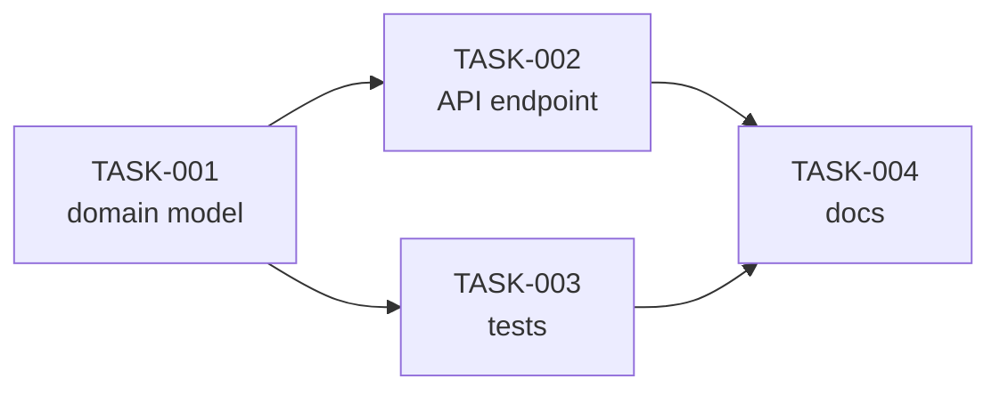

# A run, end to end

One feature, four tasks, from an empty `.agent-flow/` to a branch you can merge.

Everything below uses commands that exist today and configuration fields the schema
actually accepts. Where the output depends on a model, it is labelled as illustrative
rather than reproducible — a plan is written by a planning agent, so yours will differ
in wording even when it agrees in shape.

---

## 0. Before you start

```bash
node --version      # 20 or newer
git --version       # 2.33.0 or newer if you want worktree isolation
claude --version    # or: codex --version
```

No API key is involved anywhere in this document. Agent Flow drives the CLI you have
already logged into; if it works in your terminal, it works here.

---

## 1. Prepare the repository

```bash
cd ~/wk/booking-api
agent-flow init
```

`init` detects the stack, reads the scripts your repository actually declares, and
writes `.agent-flow/config.yaml`. It never overwrites an existing file without
`--force`, and a command it cannot find is left empty rather than guessed.

The result, filled in for a Node project:

```yaml
# .agent-flow/config.yaml
project:
  name: booking-api
  type: node

# Run by Agent Flow itself, never by an agent.
commands:
  install: npm ci
  lint: npm run lint
  typecheck: npm run typecheck
  test: npm test
  build: npm run build

paths:
  source: [src]
  tests: [test]

rules:
  architecture:
    - "Controllers do not talk to the database directly"
```

Two things are worth changing by hand before the first run:

**`commands.install: npm ci`, not `npm install`.** In worktree mode the workspace is
asserted clean after setup, and `npm install` rewrites `package-lock.json` — a tracked
modification that refuses the task. `npm ci` respects the lockfile. `agent-flow doctor`
probes this for you and names the file if it happens.

**`validationCommands`** if a task needs something narrower than the five standard
steps:

```yaml
validationCommands:
  recurrence: npm test -- recurrence
  contract: npm run test:contract
```

This is the trusted side of the boundary. A plan may name `recurrence`; it can never
carry `npm test -- recurrence`, because model output does not reach a shell.

---

## 2. Check the environment

```bash
agent-flow doctor
```

It answers one question — *can this environment run the workflow* — as `OK`,
`DEGRADED` or `FAIL`, computed over the role routes rather than over a list of
binaries. A single healthy runner is `DEGRADED` on purpose: plan review and final
review stop being cross-provider, and that loss should never be silent.

`doctor` also reports your Git version against the 2.33.0 floor, and — when
`commands.install` is set — whether that install leaves a fresh checkout clean.

`--deep` probes each runner for real, which spends quota.

---

## 3. Turn on worktree isolation (optional, and the interesting path)

```yaml
# ~/.agent-flow/config.yaml   — or the project overlay
git:
  useWorktrees: true
```

**Read this once, because the timing matters.** `git.useWorktrees` is read by
`createRun` and captured on the run. Changing it later does not move an existing run
between modes — it is the default for the *next* run. That is deliberate: planning
under one answer and implementing under another builds the work against a tree nobody
planned against, and every individual check would pass while it happened.

```yaml
parallelism:
  maxTasks: 4
```

With `useWorktrees: true` above, this is honoured: up to four tasks at once, capped at a
ceiling of 8. **Without worktrees it resolves to 1 whatever you write** — tasks would
otherwise share one working tree — and the run records a `parallelism_clamped`
degradation so the reduction is visible rather than mysterious. `agent-flow run
--dry-run` prints both numbers before anything executes.

What four concurrent tasks actually costs: four agent processes, four checkouts of this
repository, and four dependency installs. `agent-flow doctor` projects the disk before
you turn it on.

---

## 4. Plan the feature

```bash
agent-flow feature "Allow bookings to recur weekly until a cancellation date"
```

Discovery → architecture impact → SDD → plan → independent plan review, checkpointed
per stage. It stops at the gate and implements nothing.

```bash
agent-flow status
```

Read the SDD and the plan before approving. That is the whole point of the gate.

An illustrative plan for this feature — four tasks, three edges:

```json
{
  "feature": "Recurring bookings",
  "tasks": [
    {
      "id": "TASK-001",
      "title": "Recurrence rule domain model",
      "description": "Value object for a weekly recurrence with an end date.",
      "complexity": "normal",
      "risk": "medium",
      "dependencies": [],
      "requirements": ["FR-001"],
      "files": { "likely": ["src/domain/recurrence.ts"] },
      "acceptanceCriteria": [
        "A rule with an end date before its start is rejected",
        "Occurrences are generated inclusive of the start and exclusive of the end"
      ],
      "validation": ["typecheck"],
      "validationExpectation": "pass"
    },
    {
      "id": "TASK-002",
      "title": "POST /bookings accepts a recurrence",
      "description": "Extend the create endpoint and its request contract.",
      "complexity": "normal",
      "risk": "medium",
      "dependencies": ["TASK-001"],
      "requirements": ["FR-001", "FR-002"],
      "files": { "likely": ["src/http/bookings.ts"] },
      "acceptanceCriteria": [
        "A request without a recurrence behaves exactly as before",
        "An invalid recurrence returns 422 and names the field"
      ],
      "validation": ["typecheck", "lint"],
      "validationExpectation": "pass"
    },
    {
      "id": "TASK-003",
      "title": "Recurrence test suite",
      "description": "Cases for generation, boundaries and rejection.",
      "complexity": "normal",
      "risk": "low",
      "dependencies": ["TASK-001"],
      "requirements": ["FR-001"],
      "files": { "likely": ["test/recurrence.test.ts"] },
      "acceptanceCriteria": ["Every acceptance criterion of TASK-001 has a test"],
      "validation": ["recurrence"],
      "validationExpectation": "pass"
    },
    {
      "id": "TASK-004",
      "title": "Document the recurrence field",
      "description": "API reference and changelog entry.",
      "complexity": "trivial",
      "risk": "low",
      "dependencies": ["TASK-002", "TASK-003"],
      "requirements": ["FR-002"],
      "files": { "likely": ["docs/api.md"] },
      "acceptanceCriteria": ["The request example includes a recurrence"],
      "validation": [],
      "validationExpectation": "none"
    }
  ]
}
```

The DAG that plan describes:



Three waves: `{TASK-001}`, then `{TASK-002, TASK-003}`, then `{TASK-004}`. TASK-002
and TASK-003 are independent of each other, so in worktree mode they run **at the same
time**, in two different worktrees on two different branches, both cut from the same
wave base — which is the integration branch as it stood when the wave opened, with
TASK-001's work already on it.

Whichever of the two finishes first, the integration order is the plan's, not the
agents': TASK-002's marker is merged, then TASK-003's. Then the barrier closes, and
TASK-004's worktree is cut from a base that holds all three.

Two schema rules that catch bad plans before any reviewer reads them:

- a task must cite a requirement unless it is corrective, because coverage checking is
  worthless otherwise;
- `validationExpectation: "fail"` — the test-first case, where a green suite *is* the
  failure — requires at least one validation id, or the expectation is unfalsifiable.

---

## 5. Approve, and implement

```bash
agent-flow approve       # bound to this plan's hash, not the next one's
agent-flow run
```

Revise the plan and the approval stops applying. That binding is the reason `approve`
is not a flag on `run`.

In **worktree mode**, each dispatched attempt gets its own locked worktree under
`~/.agent-flow/worktrees/<repoKey>/<gitRunKey>/<taskId>/attempt-<n>`, cut from the
integration branch's head as observed at the start of the wave. The agent runs there,
the validation commands run there, and `AGENTS.md` is read from there — not from
whatever you have saved in your editor.

When validation is satisfied, the orchestrator stages the worktree, records the tree
it validated, mints a nonce, and writes `attempt-<n>.json` outside every worktree.
The marker commit is then built from that file with `commit-tree`, which is what makes
it reproducible: the same artifact yields the same commit id.

Integration happens after the wave barrier, serially, in the plan's topological order —
never in completion order. A task reaches `completed` when its marker is merged into
the integration branch, and the Integrator is the only thing allowed to write that
state.

So the middle wave, concretely:

```text
wave 2 opens        base = integration head, which holds TASK-001
   ├── TASK-002 ── own worktree, own branch ──┐   both agents inside at once
   └── TASK-003 ── own worktree, own branch ──┘
wave 2 barrier      both validated, both marked
   ├── merge TASK-002   ← the plan's order …
   └── merge TASK-003   ← … whatever order they finished in
wave 3 opens        base = integration head, which now holds all three
```

If TASK-003's merge conflicts with TASK-002's, TASK-002 stays integrated, TASK-003
becomes `review_required` with the conflicting paths recorded, and the run halts.
Nothing is resolved automatically and nothing is rolled back. A retry gives TASK-003 a
fresh worktree cut from the head as it now stands — which usually is the fix.

Your own checkout is untouched throughout. It is on whatever branch you left it on,
with whatever you had uncommitted, byte for byte.

In **sequential mode** (the default) the agent runs in your project directory and the
task completes when its validation is judged, exactly as it always has.

---

## 6. Review

```bash
agent-flow review
```

Validation, then an independent reviewer, then the Definition of Done — evaluated as
code, not by an agent saying it finished.

In worktree mode all three read the **same** tree: the integration branch, under the
run execution lock, at the commit recorded on the run as `integrationHead`. There is
no "verified tree A, reviewed tree B" gap, and the reviewer's changed-file list is
`planningBase..integration` — the feature's diff, rather than everything sitting in
your working tree.

The output tells you where the code is:

```text
FEATURE COMPLETE

  branch     agent-flow/AF-2026-001-0f3a91c4bd27e615/integration
  verified   9f2c1ab4e7d05b3c8a61fe402d7b9c3518ea6d70

Your working tree was not modified.

  Review it:   git log --oneline agent-flow/AF-2026-001-0f3a91c4bd27e615/integration
  Take it:     git merge agent-flow/AF-2026-001-0f3a91c4bd27e615/integration
```

That last command runs *your* hooks, exactly as it should. Agent Flow never merges,
never pushes, and never moves your `HEAD`.

---

## 7. Where to look afterwards

```text
.agent-flow/
├── config.yaml
├── current-run
├── cache/architecture.md
└── runs/AF-2026-001/
    ├── state.json                     the source of truth
    ├── events.jsonl                   append-only audit trail
    ├── request.md
    ├── architecture-impact.md
    ├── sdd.md
    ├── plan.json
    ├── reviews/
    │   ├── plan-review.json
    │   ├── verification.json
    │   └── final-review.json
    ├── tasks/TASK-001/
    │   ├── result.json                the task's outcome
    │   └── attempt-1.json             one attempt's evidence — worktree mode only
    └── logs/
        └── implementation-TASK-001-attempt-1.log     ← worktree mode
        └── implementation-TASK-001.log               ← sequential mode
```

Useful questions and where they are answered:

| Question | Where |
|---|---|
| Which runner, model and effort actually served this task? | `tasks/<id>/result.json` — provenance, not what config asked for |
| What tree did validation run against? | `tasks/<id>/attempt-<n>.json` → `receipt.validatedTree` |
| In what order did everything happen? | `events.jsonl` |
| Which commit was verified and reviewed? | `state.json` → `integrationHead` |
| Was this run isolated or sequential? | `state.json` → `isolationMode`, or `agent-flow status` |

In worktree mode, attempt artifacts and logs are addressed by attempt, so a retry never
overwrites the record of the attempt you are retrying because you wanted to read it.
In sequential mode the log is per task, and a retry replaces it.

---

## The same run, in the dashboard

```bash
agent-flow ui            # this project, on 127.0.0.1:4782
agent-flow ui ~/wk       # every initialised repository under ~/wk
```

Approve, revise, retry and start go through the same use cases the CLI does — the
browser is a second adapter, not a second implementation. It supplies ids and never a
path, a command or a plan hash. See [`web-ui.md`](web-ui.md).

Worktree-specific facts — attempt numbers, awaiting-integration, a conflict — are not
in the dashboard yet. That is M2-10.
